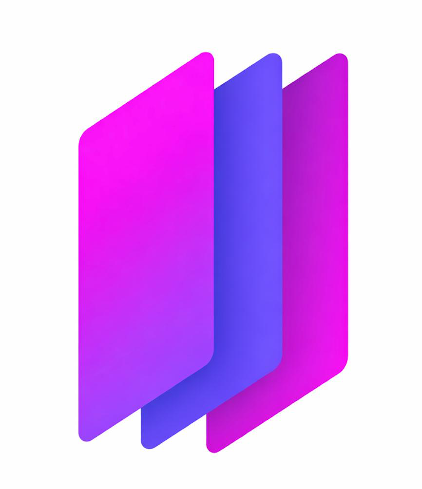

<div align="center">



# VGISkill LMS Application

**A comprehensive Learning Management System built on Frappe Framework v15**

[](https://frappeframework.com)
[](https://www.python.org/)
[](https://nodejs.org/)
[](LICENSE)

[Features](#features) • [Quick Start](#quick-start) • [Documentation](#documentation) • [Deployment](#production-deployment-gke)

</div>

---

## 📋 Table of Contents

- [Overview](#overview)
- [Features](#features)
- [Technology Stack](#technology-stack)
- [Prerequisites](#prerequisites)
- [Quick Start](#quick-start)
- [Local Development Setup](#local-development-setup)
- [Docker Setup](#docker-setup)
- [Production Deployment (GKE)](#production-deployment-gke)
- [Project Structure](#project-structure)
- [Useful Commands](#useful-commands)
- [Troubleshooting](#troubleshooting)
- [Contributing](#contributing)
- [License](#license)

## 🎯 Overview

VGISkill LMS is a modern, scalable Learning Management System built on the Frappe Framework v15. This application provides a complete solution for managing online courses, student enrollments, assessments, and payments - all in one integrated platform.

### Key Highlights

- ✅ **Full-featured LMS**: Course management, student tracking, assessments, and certifications
- ✅ **Payment Integration**: Built-in payment gateway support (Razorpay, Stripe, PayPal, and more)
- ✅ **Docker Ready**: Complete containerized setup for easy deployment
- ✅ **Production Ready**: Helm charts for Kubernetes deployment on GKE
- ✅ **Modern Stack**: Built on Frappe Framework v15 with Python 3.13 and Node.js 20

## ✨ Features

- 📚 **Course Management**: Create and manage courses, lessons, and content
- 👥 **Student Management**: Track student progress, enrollments, and achievements
- 💳 **Payment Processing**: Integrated payment gateways for course purchases
- 📊 **Analytics**: Track course performance and student engagement
- 🎓 **Certifications**: Issue certificates upon course completion
- 🔐 **Security**: Built-in authentication and authorization
- 📱 **Responsive Design**: Mobile-friendly interface
- 🌐 **Multi-tenant**: Support for multiple sites and organizations

## 🛠 Technology Stack

| Component | Technology | Version |
|-----------|-----------|---------|
| **Framework** | Frappe Framework | v15.93.0 |
| **Python** | Python | 3.13 |
| **Node.js** | Node.js | 20 |
| **Database** | MariaDB | 10.8 |
| **Cache/Queue** | Redis | 7 |
| **Container** | Docker | 20.10+ |
| **Orchestration** | Kubernetes (GKE) | - |
| **Package Manager** | Helm | 3.x |

### Installed Apps

- **Frappe**: Core framework
- **LMS**: Learning Management System app
- **Payments**: Payment gateway integration app

## 📦 Prerequisites

### For Local Development

- **Python 3.13** (Frappe v15 requires Python >= 3.10 and < 3.14)
- **Node.js 20** (installed via NVM recommended)
- **MariaDB** (running locally)
- **Redis** (running locally)
- **Yarn** (package manager)
- **Bench CLI** v5.27.0+

### For Docker

- **Docker Engine** 20.10+
- **Docker Compose** 2.0+

### For Production (GKE)

- Docker installed
- kubectl configured for GKE cluster
- Helm 3.x installed
- Access to GKE cluster: `gke-prod-asia-south1`
- Access to GCP Container Registry or Artifact Registry

## 🚀 Quick Start

### Option 1: Docker (Recommended for Quick Testing)

```bash
# Clone the repository
git clone https://github.com/shivamskr151/vgiskill_lms_app.git
cd vgiskill_lab_lms

# Start all services
docker-compose up -d --build

# Access the application
# URL: http://localhost:8000
# Username: Administrator
# Password: admin
```

### Option 2: Local Development

```bash
# Complete the Frappe setup
./complete-frappe-setup.sh

# Start the development server
cd frappe-bench
source ~/.nvm/nvm.sh && nvm use 20
bench start
```

## 💻 Local Development Setup

### Step 1: Install System Dependencies

```bash
# Install Python 3.13 (macOS)
brew install python@3.13

# Install Node.js 20 via NVM
nvm install 20
nvm use 20

# Install MariaDB and Redis
brew install mariadb redis
brew services start mariadb
brew services start redis
```

### Step 2: Complete Frappe Setup

Run the automated setup script:

```bash
./complete-frappe-setup.sh
```

Or manually:

```bash
cd frappe-bench
source ~/.nvm/nvm.sh && nvm use 20

# Drop existing site (if needed)
bench drop-site localhost --force --db-root-password YOUR_ROOT_PASSWORD

# Create new site
bench new-site localhost \
    --admin-password admin \
    --mariadb-user-host-login-scope='%' \
    --set-default \
    --db-root-password YOUR_ROOT_PASSWORD

# Install LMS app
bench --site localhost install-app lms
```

### Step 3: Start Development Server

```bash
cd frappe-bench
source ~/.nvm/nvm.sh && nvm use 20
bench start
```

### Step 4: Access the Application

- **URL**: http://localhost:8000
- **Username**: `Administrator`
- **Password**: `admin` (or the password you set during setup)

## 🐳 Docker Setup

### Quick Start with Docker Compose

1. **Build and start all services**:
   ```bash
   docker-compose up -d --build
   ```

2. **View logs**:
   ```bash
   docker-compose logs -f frappe-lms
   ```

3. **Access the application**:
   - URL: http://localhost:8000
   - Username: `Administrator`
   - Password: `admin` (or set via `ADMIN_PASSWORD` env var)

### Environment Variables

You can customize the Docker setup using environment variables:

| Variable | Default | Description |
|----------|---------|-------------|
| `DB_HOST` | `mariadb` | MariaDB hostname |
| `DB_PORT` | `3306` | MariaDB port |
| `DB_ROOT_USER` | `root` | MariaDB root username |
| `DB_ROOT_PASSWORD` | `vgiskill@2026#` | MariaDB root password |
| `SITE_NAME` | `localhost` | Frappe site name |
| `ADMIN_PASSWORD` | `admin` | Admin user password |
| `REDIS_CACHE` | `redis://redis:6379` | Redis cache URL |
| `REDIS_QUEUE` | `redis://redis:6379` | Redis queue URL |
| `REDIS_SOCKETIO` | `redis://redis:6379` | Redis socketio URL |

### Docker Commands

```bash
# Start services
docker-compose up -d

# Stop services
docker-compose down

# View logs
docker-compose logs -f frappe-lms

# Execute commands in container
docker-compose exec frappe-lms bash

# Run bench commands
docker-compose exec frappe-lms bench --site localhost migrate
docker-compose exec frappe-lms bench --site localhost clear-cache
docker-compose exec frappe-lms bench --site localhost backup

# Clean up (remove all containers and volumes)
docker-compose down -v
```

### Data Persistence

Docker Compose uses named volumes for data persistence:
- `mariadb-data`: MariaDB database files
- `redis-data`: Redis data
- `frappe-sites`: Frappe site data and files
- `frappe-logs`: Application logs

## ☁️ Production Deployment (GKE)

### Architecture

- **Cluster**: gke-prod-asia-south1
- **Region**: asia-south1
- **Zones**: asia-south1-a, asia-south1-b
- **VPC**: vpc-prod
- **Node Pool**: np-prod-app
- **Domain**: vgiskill.ai
- **Database**: MariaDB VM at 10.30.0.2:3306

### Deployment Flow

```
User (Browser)
   |
   v
DNS (vgiskill.ai → GCLB IP)
   |
   v
🌐 GCP HTTP(S) Load Balancer
   |
   v
Ingress (GKE)
   |
   v
Service (ClusterIP)
   |
   v
Pod (LMS app in np-prod-app nodepool)
   |
   v
VPC Internal Network
   |
   v
External MariaDB VM (10.30.0.2:3306)
```

### Building the Docker Image

```bash
# Build the image
docker build -t variphi/lms-app:latest .

# Tag for GCR (replace PROJECT_ID with your GCP project ID)
docker tag variphi/lms-app:latest gcr.io/PROJECT_ID/variphi/lms-app:latest

# Push to GCR
docker push gcr.io/PROJECT_ID/variphi/lms-app:latest
```

Or if using Artifact Registry:

```bash
# Tag for Artifact Registry
docker tag variphi/lms-app:latest asia-south1-docker.pkg.dev/PROJECT_ID/REPOSITORY/variphi/lms-app:latest

# Push to Artifact Registry
docker push asia-south1-docker.pkg.dev/PROJECT_ID/REPOSITORY/variphi/lms-app:latest
```

### Configuration

Edit `helm-chart/lms-app/values.yaml` to configure:
- Database connection details
- Image repository and tag
- Ingress settings
- Resource limits
- Replica count

### Deploying with Helm

```bash
# Install the chart
helm install lms-app ./helm-chart/lms-app

# Or upgrade if already installed
helm upgrade lms-app ./helm-chart/lms-app

# Check deployment status
kubectl get pods -l app.kubernetes.io/name=lms-app
kubectl get svc -l app.kubernetes.io/name=lms-app
kubectl get ingress -l app.kubernetes.io/name=lms-app
```

### Setting up SSL Certificate

For the domain `vgiskill.ai`, create a Google Managed Certificate:

```yaml
apiVersion: networking.gke.io/v1
kind: ManagedCertificate
metadata:
  name: variphi-lms-cert
spec:
  domains:
    - vgiskill.ai
```

Apply it:
```bash
kubectl apply -f managed-certificate.yaml
```

### Verifying Deployment

1. Check if the pod is running:
   ```bash
   kubectl get pods
   ```

2. Check pod logs:
   ```bash
   kubectl logs -l app.kubernetes.io/name=lms-app
   ```

3. Access the application:
   - Once DNS is configured and SSL certificate is active, visit: https://vgiskill.ai

## 📁 Project Structure

```
vgiskill_lab_lms/
├── frappe-bench/              # Frappe bench (local development)
│   ├── apps/
│   │   ├── frappe/           # Frappe Framework v15.93.0
│   │   ├── lms/              # Frappe LMS App
│   │   └── payments/         # Payments App
│   ├── sites/
│   │   └── localhost/        # Your site
│   ├── env/                  # Python virtual environment
│   └── config/               # Bench configuration
├── helm-chart/               # Kubernetes deployment configs
│   └── lms-app/              # Helm chart for LMS application
│       ├── Chart.yaml
│       ├── values.yaml
│       └── templates/         # Kubernetes templates
├── docker-compose.yml        # Docker Compose configuration
├── Dockerfile                # Docker image definition
├── docker-entrypoint.sh      # Docker entrypoint script
├── variphi-logo.png          # VariPhi logo
└── README.md                 # This file
```

## 🔧 Useful Commands

### Local Development

```bash
# Start development server
cd frappe-bench
source ~/.nvm/nvm.sh && nvm use 20
bench start

# Stop development server
bench stop

# Update apps
bench update

# Build assets
bench build

# Clear cache
bench clear-cache

# Run migrations
bench --site localhost migrate

# Create backup
bench --site localhost backup

# Restore backup
bench --site localhost restore /path/to/backup.tar.gz
```

### Docker

```bash
# Start all services
docker-compose up -d

# Stop all services
docker-compose down

# View logs
docker-compose logs -f

# Execute commands in container
docker-compose exec frappe-lms bash

# Run bench commands
docker-compose exec frappe-lms bench --site localhost migrate
```

### Production (Kubernetes)

```bash
# Check pod status
kubectl get pods -l app.kubernetes.io/name=lms-app

# View logs
kubectl logs -l app.kubernetes.io/name=lms-app -f

# Execute commands in pod
kubectl exec -it <pod-name> -- bash

# Scale deployment
kubectl scale deployment lms-app --replicas=3
```

## 🐛 Troubleshooting

### Local Development Issues

#### Python Version Error

**Error**: `Package 'frappe' requires a different Python: 3.14.0 not in '<3.14,>=3.10'`

**Solution**: Frappe v15 requires Python 3.10-3.13. Recreate the virtual environment:
```bash
cd frappe-bench
rm -rf env
python3.13 -m venv env
bench setup requirements
```

#### Database Connection Issues

1. **Check MariaDB is running**:
   ```bash
   brew services list | grep mariadb
   ```

2. **Check Redis is running**:
   ```bash
   brew services list | grep redis
   ```

3. **Verify site configuration**:
   ```bash
   cat frappe-bench/sites/localhost/site_config.json
   ```

#### Port Conflicts

If ports are in use, edit `frappe-bench/sites/common_site_config.json`:
```json
{
  "webserver_port": 8001
}
```

### Docker Issues

#### Container Won't Start

1. **Check logs**:
   ```bash
   docker-compose logs frappe-lms
   ```

2. **Verify database connection**:
   ```bash
   docker-compose exec frappe-lms mysql -h mariadb -u root -p
   ```

3. **Check Redis connection**:
   ```bash
   docker-compose exec frappe-lms redis-cli -u redis://redis:6379 ping
   ```

#### Site Creation Fails

1. **Check if site already exists**:
   ```bash
   docker-compose exec frappe-lms ls -la /home/frappe/frappe-bench/sites/
   ```

2. **Manually create site**:
   ```bash
   docker-compose exec frappe-lms bench new-site localhost \
     --admin-password admin \
     --db-root-password vgiskill@2026#
   ```

#### Port Conflicts

If ports 8000, 9000, 3306, or 6379 are already in use, modify the port mappings in `docker-compose.yml`:
```yaml
ports:
  - "8001:8000"  # Change host port
  - "9001:9000"
```

### Production Deployment Issues

1. **Pod not starting**: Check logs with `kubectl logs <pod-name>`
2. **DB connection failed**: Verify network connectivity from pod to 10.30.0.2:3306
3. **Ingress not working**: Check ingress status and managed certificate status
4. **DNS not resolving**: Verify DNS configuration points to GCLB IP

## 🤝 Contributing

Contributions are welcome! Please feel free to submit a Pull Request.

1. Fork the repository
2. Create your feature branch (`git checkout -b feature/AmazingFeature`)
3. Commit your changes (`git commit -m 'Add some AmazingFeature'`)
4. Push to the branch (`git push origin feature/AmazingFeature`)
5. Open a Pull Request

## 📚 Additional Resources

- [Frappe Framework Documentation](https://docs.frappe.io/framework)
- [Frappe LMS GitHub](https://github.com/frappe/lms)
- [Bench CLI Documentation](https://github.com/frappe/bench)
- [Docker Documentation](https://docs.docker.com/)
- [Kubernetes Documentation](https://kubernetes.io/docs/)

## 📄 License

This project is built on Frappe Framework, which is licensed under MIT.

---

<div align="center">

**Built with ❤️ by [VariPhi](https://variphi.com)**

[](https://github.com/shivamskr151/vgiskill_lms_app)
[](https://github.com/shivamskr151/vgiskill_lms_app/issues)
[](https://github.com/shivamskr151/vgiskill_lms_app/stargazers)

</div>
